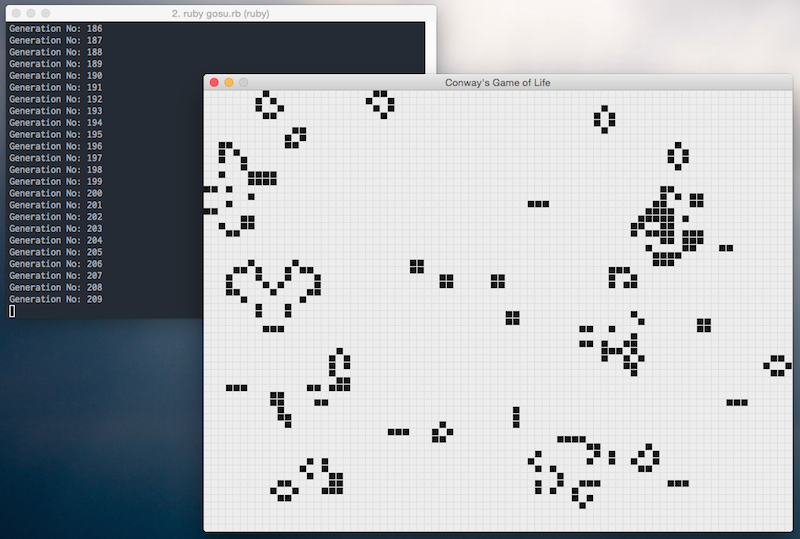

# Conway's Game of Life

This is a simple implementation of Conway's Game of Life written in the Ruby programming language.

## Synopsis

Please note that much of the work here was based upon the [ofcan / game-of-life-ruby](https://github.com/ofcan/game-of-life-ruby) repository.

You can find out more about the Game of Life on it's [Wikipedia entry](http://en.wikipedia.org/wiki/Conway%27s_Game_of_Life).

The [Gosu 2D geme development library](http://www.libgosu.org) was used to generate the graphical output, resulting in the final result shown here:



## Rules of the game:

The rules of the game are explained clearly in it's [Wikipedia entry](http://en.wikipedia.org/wiki/Conway%27s_Game_of_Life). The relevent portion is quoted here:

> The universe of the Game of Life is an infinite two-dimensional orthogonal grid
> of square cells, each of which is in one of two possible states, alive or dead.
> Every cell interacts with its eight neighbours, which are the cells that are
> horizontally, vertically, or diagonally adjacent. **At each step in time, the
> following transitions occur:**
> 
> 1. Any live cell with fewer than two live neighbours dies, as if caused by under-population.
> 2. Any live cell with two or three live neighbours lives on to the next generation.
> 3. Any live cell with more than three live neighbours dies, as if by overcrowding.
> 4. Any dead cell with exactly three live neighbours becomes a live cell, as if by reproduction.

> The initial pattern constitutes the seed of the system. The first generation is
> created by applying the above rules simultaneously to every cell in the
> seed—births and deaths occur simultaneously, and the discrete moment at which
> this happens is sometimes called a tick (in other words, each generation is a
> pure function of the preceding one). The rules continue to be applied repeatedly
> to create further generations.


## Installation & Usage

To get started you'll first want to install the required Ruby gems and you can do so easily using bundler:

```console
bundle install
```

Once the gems have been installed successfully, you can play the Game of Life by passing the gosu.rb file to the Ruby interpreter:

```console
ruby gosu.rb
```

## Tests

Tests are run on the command line using RSpec:

```console
rspec spec_game_of_life.rb
```

## License

MIT License. Copyright 2015 [Derek Barber](http://derekbarber.ca)